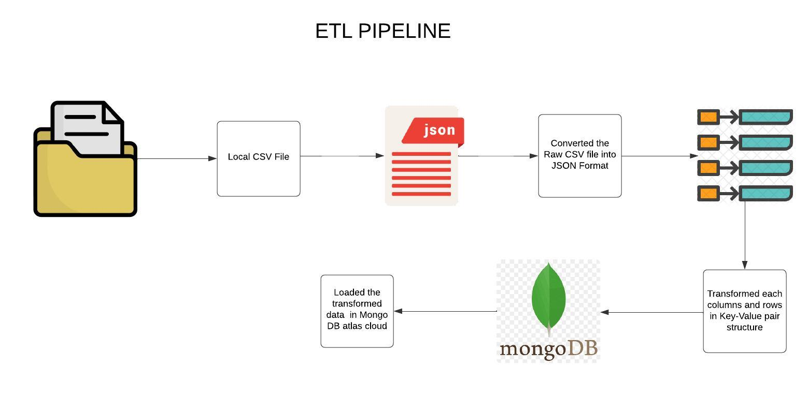
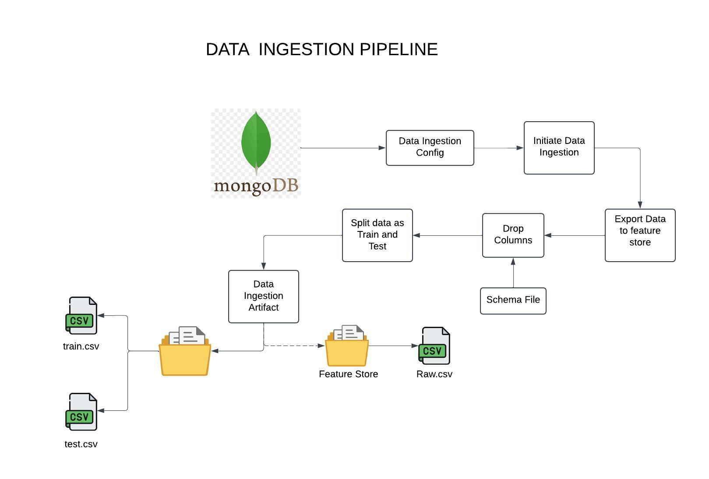
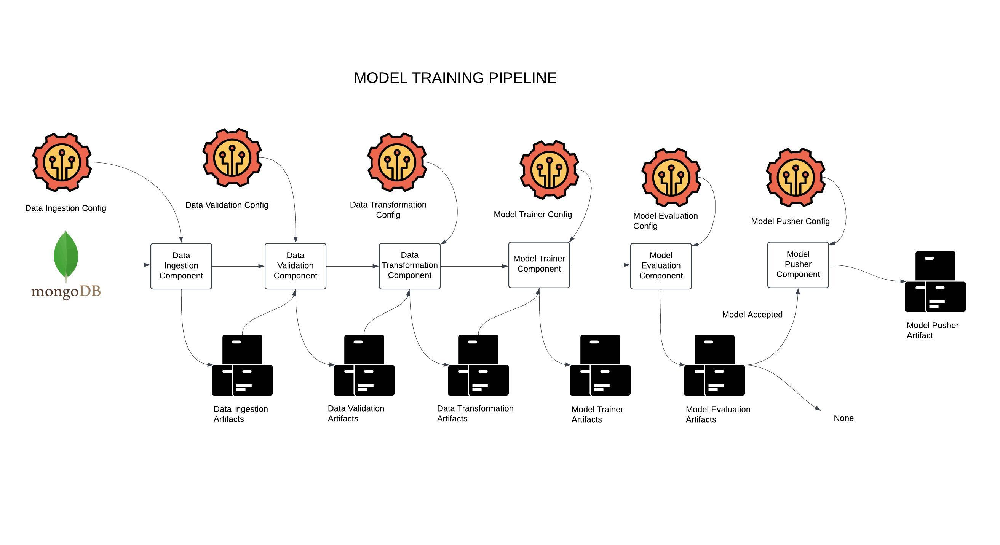
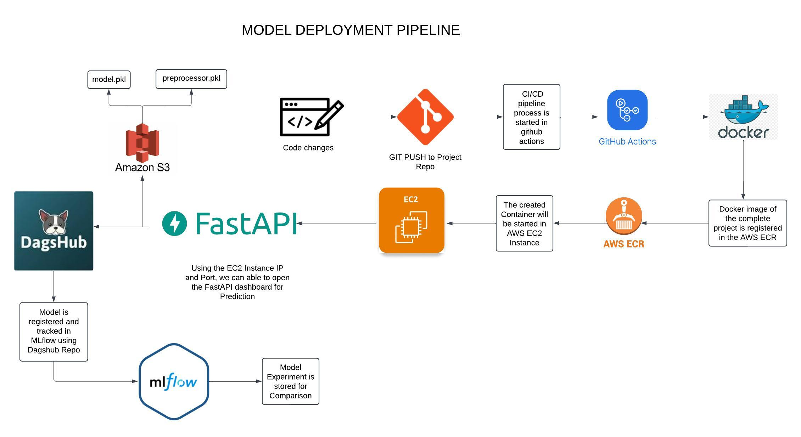
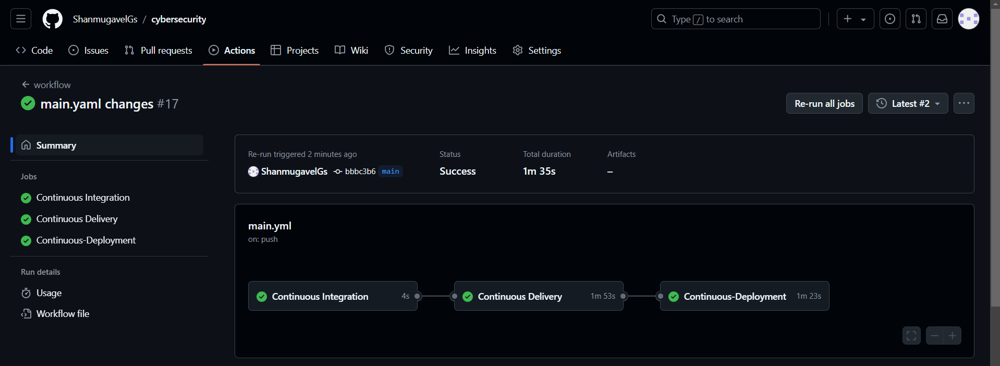

# Phishing URL Detection End to End MLOps Project

## Table of Content

- [Problem Statement](#problem-statement)
- [DagsHub Repo Link](#dagshub-repo-link)
- [Objectives](#objectives)
- [ETL Pipeline](#etl-pipeline)
- [Data Ingestion Pipeline](#data-ingestion-pipeline)
- [Model Training Pipeline](#model-training-pipeline)
- [Model Deployment Pipeline](#model-deployment-pipeline)
- [Project Highlights](#project-highlights)
- [CI/CD Pipeline](#ci/cd-pipeline)
- [Technologies Used](#technologies-used)

## Problem Statement

In the digital era, phishing attacks have become a significant threat to internet users, with malicious URLs being a primary vehicle for fraud. These phishing links deceive users into divulging sensitive information, such as passwords and financial details, causing substantial financial and data losses. Traditional methods of detecting phishing URLs, like blacklists, are often reactive and fail to catch newly generated malicious URLs.

This project aims to develop a machine learning-based phishing detection system that analyzes various features of URLs (e.g., structure, security protocols, and behaviors) to classify them as phishing or legitimate. By leveraging this system, organizations and individuals can proactively identify and block phishing attempts, ensuring a safer online experience.

---

## DagsHub Repo Link

Check out the DagsHub repository below to explore my ML flow experiments for this Phishing URL Detection Project:

[Phishing URL Detection Project on DagsHub](https://dagshub.com/gsshanmugavel/cybersecurity)

---

## Objectives

- Build a **scalable and modular End-to-End ML pipeline** for detecting phishing URLs.
- Implement a **production-level structure** to ensure maintainability and reusability of code.
- Develop a robust **ETL pipeline** to handle data ingestion, transformation, and storage in **MongoDB Atlas Cloud**.
- Enable real-time and batch predictions through a **FastAPI-based web application**.
- Automate the pipeline with **GitHub Actions** for **CI/CD** and deploy the system using **Docker** on **AWS EC2**.
- Track and monitor model experiments and metrics using **MLflow** integrated with **DagsHub**.
- Ensure **data validation** and **logging** mechanisms for reliability and error handling.
- Deploy a **cloud-based solution** leveraging **AWS S3, ECR, and EC2** for efficient model hosting.

---

## ETL Pipeline

---

## Data Ingestion Pipeline

---

## Model Training Pipeline

---

## Model Deployment Pipeline

---

## Project Highlights

- **Developed** an **End-to-End ML pipeline** for Phishing URL Detection using modular coding practices, ensuring scalability and maintainability.  
- **Organized** the project into a **production-level structure** with separate modules for **Data Ingestion**, **Validation**, **Transformation**, **Model Training**, **Evaluation**, and utilities for common operations such as YAML file handling.  
- **Designed** entity classes for **Config** and **Artifact** management to streamline workflow tracking and logging.  
- **Implemented** an **ETL pipeline** to extract data from local CSV files, transform it into **JSON with key-value pairs**, and load it into **MongoDB Atlas Cloud** for seamless storage and retrieval.  
- **Integrated** model tracking and versioning using **MLflow** on **DagsHub**, ensuring robust experiment tracking and performance reproducibility.  
- **Automated** **CI/CD pipelines** with **GitHub Actions**, leveraging **AWS S3**, **ECR**, and **EC2** for cloud deployment and model hosting.  
- **Containerized** the entire pipeline using **Docker**, deploying the solution to **AWS EC2 instances** for scalable and efficient execution.  
- **Developed** a **FastAPI-based web application** for **real-time** and **batch prediction**, enabling users to classify URLs via a user-friendly interface.  
- **Implemented** **batch prediction capabilities** for large datasets, ensuring high-performance processing of multiple records simultaneously.  
- **Ensured** **data schema validation** through a dedicated schema file and implemented comprehensive logging and exception handling mechanisms.  
- **Leveraged** modular and reusable components, enabling **batch prediction** and **model training pipelines** in isolation for streamlined updates and maintenance.  
- **Achieved** seamless integration of the system with **AWS Cloud services**, ensuring efficient storage, retrieval, and hosting of models and data.
- **Trained** various models including **Random Forest**, **Decision Tree**, **Gradient Boosting**, **Logistic Regression**, and **AdaBoost**, and performed **hyperparameter tuning** to select the best-performing model.

---

## CI/CD Pipeline

---

## Technologies Used

### Programming and Libraries
- **Python**: For implementing the pipeline components.
- **FastAPI**: To develop the web application for predictions.
- **Pandas**: For data manipulation and transformation.
- **MLflow**: For tracking experiments and model performance.

### Cloud and Deployment
- **AWS S3**: For storing data and model artifacts.
- **AWS ECR**: For managing Docker images.
- **AWS EC2**: For deploying the Dockerized application.
- **MongoDB Atlas Cloud**: For data storage and retrieval.

### DevOps and CI/CD
- **Docker**: For containerizing the application.
- **GitHub Actions**: To automate CI/CD pipelines.

### Data Storage and Validation
- **MongoDB Atlas Cloud**: For storing processed data in JSON format.
- **YAML**: For configuration management and schema validation.

### Monitoring and Experiment Tracking
- **MLflow**: To track models and experiments.
- **DagsHub**: For centralized monitoring of ML pipelines and metrics.

### General Utilities
- **Logging**: For tracking errors and events in the system.
- **Exception Handling**: To ensure robustness of the pipeline.
- **JSON**: For structured data representation during ETL.

---

